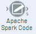

# Roteiro de integração Spark / Alteryx


## Versão 2.0.1


## Autor

André Carneiro [andre.carneiro@keyrus.com.br](mailto:andre.carneiro@keyrus.com.br)


## Introdução

Esse material é um roteiro para **desenvolvedores** que queiram entender como ligar o Alteryx ao *Spark* utilizando *Apache Livy* em uma máquina virtual(*VM*) Cloudera *CDH 5.13x* utilizando rpm **packages** e instalações manuais.


## Pré-requisitos

* Processador i5 com 16GB de RAM
* Virtualbox 5
* VM oficial da Cloudera CDH 5
* Alteryx Design


## Antes de inicializar a VM

A VM da Cloudera vem com os recursos ao mínimo. Isso acaba atrapalhando o próprio Cloudera Manager que muitas vezes não consegue inicializar alguns serviços por falta de recurso(memória, normalmente), o que atrapalha bastante.

Para evitar isso, antes de inicializar a VM, aumente os recursos de memória, vídeo, processamento ao máximo possível.

Também adicione uma interface de rede para que a VM esteja acessível do Windows(isso deve ser feito antes de inicializar a VM).

No Virtualbox, uma vez que a *appliance* esteja importada, selecione-a e vá em *Máquina >> Configurações*


Então percorra as opções(Geral, Sistema, etc) e aumente tudo ao máximo possível.


Um item em particular exige um outro tipo de atenção, a **Rede**. É preciso adicionar uma interface(caso já não tenha sido adicionada), para que a VM fique visível para que o Alteryx consiga acessar o Spark. Para isso, com a VM **desligada**, vá em *Configurações > Rede*, então configure dessa forma na aba "Adaptador 2"


Então, ligue a máquina virtual e abra um terminal. Depois digite o comando:

```
$ ifconfig
enp0s3    Link encap:Ethernet  HWaddr 08:00:27:2b:04:c7  
          inet addr:10.0.2.15  Bcast:10.0.2.255  Mask:255.255.255.0
          UP BROADCAST RUNNING MULTICAST  MTU:1500  Metric:1
          RX packets:665365 errors:0 dropped:0 overruns:0 frame:0
          TX packets:74038 errors:0 dropped:0 overruns:0 carrier:0
          collisions:0 txqueuelen:1000 
          RX bytes:788467160 (788.4 MB)  TX bytes:8166190 (8.1 MB)

enp0s8    Link encap:Ethernet  HWaddr 08:00:27:83:3e:25  
          inet addr:192.168.56.4  Bcast:192.168.56.255  Mask:255.255.255.0
          inet6 addr: fe80::5a6a:495e:570b:dca9/64 Scope:Link
          UP BROADCAST RUNNING MULTICAST  MTU:1500  Metric:1
          RX packets:18631 errors:0 dropped:0 overruns:0 frame:0
          TX packets:20602 errors:0 dropped:0 overruns:0 carrier:0
          collisions:0 txqueuelen:1000 
          RX bytes:2711228 (2.7 MB)  TX bytes:3901519 (3.9 MB)

lo        Link encap:Local Loopback  
          inet addr:127.0.0.1  Mask:255.0.0.0
          UP LOOPBACK RUNNING  MTU:65536  Metric:1
          RX packets:1082237 errors:0 dropped:0 overruns:0 frame:0
          TX packets:1082237 errors:0 dropped:0 overruns:0 carrier:0
          collisions:0 txqueuelen:1 
          RX bytes:564530242 (564.5 MB)  TX bytes:564530242 (564.5 MB)
```


A primeira interface é o NAT(Adaptador 1), o IP dela não nos interessa. A segunda interface é a interface recém-configurada(Adaptador 2). Esse é o IP que será usado na conexão com o Alteryx posteriormente. Guarde-o! 


## Mudando a versão do Java

Creio que o melhor ponto para começar é alterar a versão do JDK. Tem vários bons motivos para fazer isso. Para a ligação entre o Spark e o Alteryx, o motivo é que o Spark 2.3 simplesmente não funciona com o JDK 1.7. Logo é necessário mudar para a versão 1.8.


Para fazer isso, siga os passos abaixo: 

1. Faça o download da versão **rpm do JDK 1.8 no site da Oracle**(é preciso ter uma conta Oracle. Se não tiver, crie uma!)

   ​

   [Download do JDK](https://duckduckgo.com/?q=download+jdk+1.8&t=brave&ia=web)

   ​

2. Instale o pacote **rpm** com o comando

    `$ sudo rpm -ivh <CAMINHO_E_NOME_DO_PACOTE_DO_JDK_1.8>.rpm`


3. Vá para o diretório de instalação `/usr/java` e remova o link *latest* executando:

   `$ sudo rm latest`

   ​

4. Recrie o link *latest* apontando para o diretório da versão 1.8 do JDK

   `$ sudo ln -s jdk1.8.0_211-amd64 latest`

   ​

5. modifique a variável de ambiente `JAVA_HOME` em `/etc/profile`

   `$ sudo vim /etc/profile`

   * Procure a variável `JAVA_HOME` 

   * substitua o valor para `/usr/java/latest`

   * Salve o arquivo e saia do vim digitando `:wq` e depois pressionando `ENTER`

     ​

6. execute o comando `source /etc/profile`

   ​

7. Verifique a variável `JAVA_HOME`

   ```
   $ env |grep JAVA_HOME
   JAVA_HOME=/usr/java/latest
   ```

   ​

8. Verifique a versão que está ativa no sistema executando o comando abaixo

   ```
   $ java -version
   java version "1.8.0_211"
   Java(TM) SE Runtime Environment (build 1.8.0_211-b12)
   Java HotSpot(TM) 64-Bit Server VM (build 25.211-b12, mixed mode)
   ```

   ​

   ​


## Cloudera Manager

Ainda não terminamos com o Java!


### Ajustando parâmetros do Java

Infelizmente só alterar a versão do Java e configurar as variáveis de ambiente não é o suficiente para o Cloudera Manager, porque ele mantém um mapeamento próprio de vários parâmetros que utiliza. Felizmente, todos eles são facilmente encontrados na interface do Cloudera Manager.

Para modificar a versão do JDK que o Cloudera Manager está "enxergando", acesse a página do host "quickstart.cloudera". Para isso, acesse *Hosts >> All Hosts*, depois clique no link "quickstart.cloudera", e na aba "Configuration". A página deve ser essa: 


Agora é só alterar o item "Java home Directory" e salvar.


**ATENÇÃO:** O Cloudera Manager também vai alertar sobre vários parâmetros de alguns serviços como HDFS, Hive, Zookeeper etc, que precisam ser alterados para os valores recomendados(a maioria deles tem a ver com a JVM, logo... Java). É preciso modificar quando possível e suprimir os parâmetros que dependem de infraestrutura extra(load balancers por exemplo). Todos os alertas estão identificados na página principal do Cloudera Manager pelo ícone  . Para alterar, basta clicar no ícone, acessar as páginas dos parâmetros, e depois seguir as instruções para adequar os valores. **Não esqueça de salvar!**


Uma vez que os parâmetros estejam adequados, vá para o terminal e reinicie o Cloudera Manager

```
$ cd ~ && sudo ./cloudera-manager --express --force
[QuickStart] Shutting down CDH services via init scripts...
kafka-server: unrecognized service
[QuickStart] Disabling CDH services on boot...
error reading information on service kafka-server: No such file or directory
[QuickStart] Starting Cloudera Manager server...
[QuickStart] Waiting for Cloudera Manager API...
[QuickStart] Starting Cloudera Manager agent...
[QuickStart] Configuring deployment...
Submitted jobs: 76
[QuickStart] Deploying client configuration...
Submitted jobs: 77
[QuickStart] Starting Cloudera Management Service...
Submitted jobs: 85
[QuickStart] Enabling Cloudera Manager daemons on boot...
________________________________________________________________________________

Success! You can now log into Cloudera Manager from the QuickStart VM's browser:

    http://quickstart.cloudera:7180

    Username: cloudera
    Password: cloudera
```


Agora acesse a página do [Cloudera Manager](http://quickstart.cloudera:7180)


Os serviços essenciais que devem estar ok são:


* Zookeeper
* HDFS
* Yarn
* Hive


## Instalando o Anaconda


1. Download(versão 3-2019.03 para arquitetura Linux-x86_64)

   ```
   $ wget https://repo.anaconda.com/archive/Anaconda3-2019.03-Linux-x86_64.sh
   ```

   ​

2. Adicione permissão de execução no script de instalação e execute

   ```
   $ chmod +x Anaconda3-2019.03-Linux-x86_64.sh && ./Anaconda3-2019.03-Linux-x86_64.sh
   ```

   ​

3. Ative o ambiente do *Anaconda* executando `source ~/.bashrc` ou abrindo outro terminal . 

   ​

4. Verifique a versão do Python(Deve ser no mínimo *3.6.x*)

   ```
   $ python --version
   Python 3.7.3
   ```

   ​

## Instalando o Spark 2.3

1. Download do **Spark 2.3** para o **hadoop 2.6** no **site da Apache**

   ​

   ```
   $ cd ~/Download && wget https://archive.apache.org/dist/spark/spark-2.3.3/spark-2.3.3-bin-hadoop2.6.tgz 
   ```

   ​

2. Descompacte e copie para /usr/lib/

   ​

   `$ unzip spark-2.3.3-bin-hadoop2.6.tgz && sudo cp -R spark-2.3.3-bin-hadoop2.6 /usr/lib`

   ​

3. No diretório `/usr/lib/` crie o link *spark* apontando para o diretório do spark 2.3

   ​

4. Exporte a variável `SPARK_HOME` e salve em `~/.bashrc`

   ​

   `$ echo "export SPARK_HOME=/usr/lib/spark" >>~/.bashrc `

   ​

5. Faça o mesmo com a variável `SPARK_MAJOR_VERSION` 

   ​

   `$ echo "export SPARK_MAJOR_VERSION=2" >>~/.bashrc `

   ​

   Acesse `/usr/lib/spark/sbin` e execute o script `spark-config.sh` 

   ​

   ```
   $ source spark-config.sh && env |grep SPARK
   SPARK_HOME=/usr/lib/spark
   SPARK_CONF_DIR=/usr/lib/spark/conf
   SPARK_MAJOR_VERSION=2
   PYSPARK_PYTHONPATH_SET=1
   ```

   Salve as variáveis no arquivo `~/.bashrc`

   ​

6. Execute o comando `source ~/.bashrc`

   ​


### Preparando o Hadoop para o Spark

1. Exporte as variáveis `HADOOP_HOME`, `HADOOP_LIBEXEC` e  `HADOOP_CONF_DIR` e salve em `/etc/profile`

   ```
   export HADOOP_HOME=/usr/lib/hadoop
   export HADOOP_LIBEXEC_DIR=/usr/lib/hadoop
   export HADOOP_CONF_DIR=/etc/hadoop/conf 
   ```

   ​

2. Verifique as variáveis

   ```
   $ env |grep HADOOP
   HADOOP_HOME=/usr/lib/hadoop
   HADOOP_LIBEXEC_DIR=/usr/lib/hadoop
   HADOOP_CONF_DIR=/etc/hadoop/conf
   ```

   Salve os "exports" dessas variáveis no arquivo `/etc/profile`


### Testando o pySpark


Primeiro crie 2 arquivos *CSV* e salve no *HDFS* em `/user/cloudera/test/files`.

test.csv

```CSV
id,name
1,Joao
2,Pedro
```


test2.csv

```csv
id,name,age
1,Joao,22
2,Pedro,40
3,Sara,31
4,Barbara,29
```


Salvando os arquivos no *HDFS*

```
$ hdfs dfs -put test.csv test2.csv /user/cloudera/test/files
```


Então, execute o comando `pyspark`

```
$ pyspark
Python 3.7.3 (default, Mar 27 2019, 22:11:17) 
[GCC 7.3.0] :: Anaconda, Inc. on linux
Type "help", "copyright", "credits" or "license" for more information.
Setting default log level to "WARN".
To adjust logging level use sc.setLogLevel(newLevel). For SparkR, use setLogLevel(newLevel).
Welcome to
      ____              __
     / __/__  ___ _____/ /__
    _\ \/ _ \/ _ `/ __/  '_/
   /__ / .__/\_,_/_/ /_/\_\   version 2.3.3
      /_/

Using Python version 3.7.3 (default, Mar 27 2019 22:11:17)
SparkSession available as 'spark'.
```


Agora, com a variável *spark*(que é um objeto *pyspark.SparkSession*), teste o acesso do *Spark* ao HDFS executando o código abaixo

```Python
>>> df = spark.read.csv('/user/cloudera/test/files/test.csv',header=True);df.show()
```


Deve-se ver o resultado dessa forma:

```
+---+-----+
| id| name|
+---+-----+
|  1| Joao|
|  2|Pedro|
+---+-----+
```


## Instalando o HTTPFS


O serviço do *HTTPFS* normalmente vem instalado, porém não é ativado por padrão. Para testar, utilize o comando abaixo.

```
$ sudo service hadoop-httpfs status
Hadoop httpfs is not running                               [FAILED]
```


Para inicializar o *httpfs* execute o comando: 

```
$ sudo service hadoop-httpfs start
Started Hadoop httpfs (hadoop-httpfs):                     [  OK  ]
```


Agore finalize a configuração seguindo os seguintes passos


1. Salve as seguintes variáveis de ambiente no arquivo `/etc/profile`

   ```
   export HTTPFS_SSL_ENABLED=false
   export HTTPFS_SSL_CLIENT_AUTH=false
   export HTTPFS_HTTP_HOSTNAME=quickstart.cloudera
   export HTTPFS_TEMP=/usr/lib/hadoop-httpfs/temp
   export HTTPFS_HTTP_PORT=14000
   export HTTPFS_HOME=/usr/lib/hadoop-httpfs
   export HTTPFS_LOG=/usr/lib/hadoop-httpfs/logs
   export HTTPFS_ADMIN_PORT=14001
   export CATALINA_HOME=/usr/lib/bigtop-tomcat
   ```

   ​

2. Inicie/Reinicie o serviço

   `$ sudo service hadoop-httpfs restart`

   ​

3. Verifique se o serviço está "escutando" na porta 14000

   ```
   $ netstat -nplt |grep 14000
   tcp        0      0 0.0.0.0:14000               0.0.0.0:*                   LISTEN      12589/java
   ```

   ​

   ​

   ​


## Instalando o Livy

A Cloudera **não suporta** o *Apache Livy* por padrão. Então é necessário instalar manualmente. Para isso siga os passos abaixo:


1. Download da versão 0.6

   ```
   $ wget https://www.apache.org/dyn/closer.lua/incubator/livy/0.6.0-incubating/apache-livy-0.6.0-incubating-bin.zip 
   ```

   ​

2. Descompactando 

   ```
   unzip apache-livy-0.6.0-incubating-bin.zip && cd apache-livy-0.6.0-incubating-bin
   ```

   ​

3. Verificando variáveis de ambiente

   Spark

   ```
   $ env |grep SPARK
   SPARK_HOME=/usr/lib/spark
   SPARK_CONF_DIR=/usr/lib/spark/conf
   SPARK_MAJOR_VERSION=2
   PYSPARK_PYTHONPATH_SET=1
   ```

   HTTPFS

   ```
   $ env |grep HTTPFS
   HTTPFS_SSL_ENABLED=false
   HTTPFS_SSL_CLIENT_AUTH=false
   HTTPFS_HTTP_HOSTNAME=quickstart.cloudera
   HTTPFS_TEMP=/usr/lib/hadoop-httpfs/temp
   HTTPFS_HTTP_PORT=14000
   HTTPFS_HOME=/usr/lib/hadoop-httpfs
   HTTPFS_LOG=/usr/lib/hadoop-httpfs/logs
   HTTPFS_ADMIN_PORT=14001
   ```

   Hadoop/tomcat(CATALINA)

   ```
   $ env |grep HADOOP && env |grep CATALINA
   HADOOP_HOME=/usr/lib/hadoop
   HADOOP_LIBEXEC_DIR=/usr/lib/hadoop
   HADOOP_CONF_DIR=/etc/hadoop/conf
   CATALINA_HOME=/usr/lib/bigtop-tomcat
   ```

   ​

   ​


## Alteryx

Nesse momento, todo o ambiente na VM está pronto para prover "Spark" para o Alteryx. Mas primeiro vamos criar dois arquivos csv dentro do HDFS da VM para depois tentar acessá-los com o Alteryx.


test001.csv

```
id,name,age
1,Andre,40
2,Azize,35
3,Isac,10
4,Fabio,30
5,Luiz,29
```


test002.csv

```
id,name,age
7,Ju,30
8,Dani,29
9,Barbara,32
```


Salve no HDFS

`hdfs dfs -put test001.csv /alteryx/files/ && hdfs dfs -put test002.csv /alteryx/files/`


Agora siga os passos a seguir para configurar o Alteryx com o Spark:


1. Crie um novo *workflow* e encontre a aba *In-DB*. Depois adicione o componente *Connect In-Db*

   


1. Nas propriedades, clique na caixa de seleção e selecione *Manage Connections*

   


1. Uma caixa de diálogo irá se abrir. Use a figura abaixo como referência e configure da mesma forma.


   

   

   

   

1. Na caixa *Connection String*, escolha *New Database Connection*. Uma caixa de diálogo para conexão com o *Livy* será aberta. Configure dessa forma:

   


   Na aba *Host* deve-se colocar o IP da VM ou o IP conforme visto no capítulo [Preparando a VM](#preparando-a-vm). 

   Atente que na parte do *Livy*, em cima, a porta já está configurada com a padrão 8998. Deixe assim!

   Na parte do Spark, apenas selecione a versão do Spark que está disponível na sua VM. No caso do    exemplo, é a opção *2.2 - 2.3*.

   Na parte do HDFS, abra a caixa *Server Configuration*, e mude para HTTPFS. A porta irá mudar automaticamente para 14000. Então adicione o usuário da VM e a senha(no caso da VM Cloudera, o usuário e a senha são 'cloudera').

​    

**Teste as conexões!**

Apenas pressione os botões de teste(*Test*). Tudo deve ficar "verde"!


Depois de salvar, deve-se estar disponível a conexão com o nome que foi dado. No caso do exemplo, "spark-livy-conn". 

   

   

1. Clicando nela, a seguinte tela deve aparecer

   

   Escolha o arquivo "test001.csv" e clique em OK!


1. Adicione o componente que permite escrever scripts pyspark. Ela está na aba *developer*

   


   Zoom

   

   

   

   

1. Agora basta ligar o objeto de conexão com o objeto do Spark. Nenhuma mensagem de erro deve ocorrer.

   


1. Com as conexões ok, hora de escrever o script. Clique no componente *Apache Spark* e vá nas propriedades, e em *Code Editor* e adicione o script

   ```python
   # Start typing code here or insert Alteryx-specific
   # functions with the above "Insert Code" button.
   # SparkContext is available through the sc variable.
   # SqlContext is available through the sqlContext variable.
   import pyspark
   import pyspark.sql
   from pyspark.sql import SparkSession
   from pyspark.sql.types import IntegerType


   """Esse script basicamente recupera dados do componente *Connect In-DB*, onde foi configurado para recuperar dados do arquivo "test001.csv". Para recuperar os dados do Alteryx, deve-se utilizar a função *readAlteryxData()*, passando como parâmetro o id da conexão, no caso, '1'. Para esse dado uma transformação foi executada no dataframe através do método 'withColumn', criando outra coluna do dataframe chamada 'dogAge'. A saída é enviada para o próximo componente do fluxo. Esse componente aceita até 5 saídas. Nesse caso, os dados estão saindo pela saída de id '1', e isso é referenciado através da função writeAlteryxData(), passando o dataframe 'df' e o id da saída, no caso, 1.
   """    
       
       
   # The readAlteryxData function returns the incoming data as a SparkSQL DataFrame.
   df = readAlteryxData(1)

   df = df.withColumn('dogAge',(df['age'].cast(IntegerType()) * 7))

   # The writeAlteryxData function outputs the data argument which must be a SparkSQL DataFrame.
   writeAlteryxData(df, 1)

   ###################################################################

   """
   Adicionalmente, para demonstrar que é possível também recuperar dados diretamente do HDFS usando um objeto *SparkSession*, foi adicionado um objeto *SparkSession* que tem a propriedade *read* , utilizado para recuperar dados do arquivo *test002.csv*. Da mesma forma, foi utilizado para gravar os dados da saída na função writeAlteryxData(), mas passando o id da saída com o valor '2'.
   """


   # Getting data using a new SparkSession object

   try:
   	spark = SparkSession.builder.appName('livyTests').getOrCreate()
   except Exception as e:
     	# The logAlteryxError function writes the argument (string) to the log as an error.
   	logAlteryxError("Spark error: " + str(e))


      df2 = spark.read.csv('/alteryx/files/test002.csv',header=True)

   # The writeAlteryxData function outputs the data argument which must be a SparkSQL DataFrame.

      writeAlteryxData(df2, 2)

     

   ```


No componente Apache Spark


2. Uma vez que as saídas estejam determinadas, agora resta continuar o fluxo. Para isso utiliza-se o componente *Data Stream Out*, da aba *In-Database*.

   ​


   Não precisa configurar nada nele. É apenas para tornar compatível a saída para  o próximo componente, o *Browse*. Basta adicioná-lo a partir da aba *In/Out*


​    

​    

Repita o processo descrito no item '2' adicionando o componente  *Data Stream In* à saída '2' do componente *Apache Spark*. A solução completa no Alteryx:


Pressione "Run". A execução deve terminar sem erros.